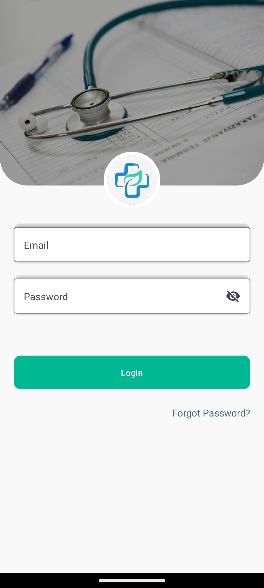
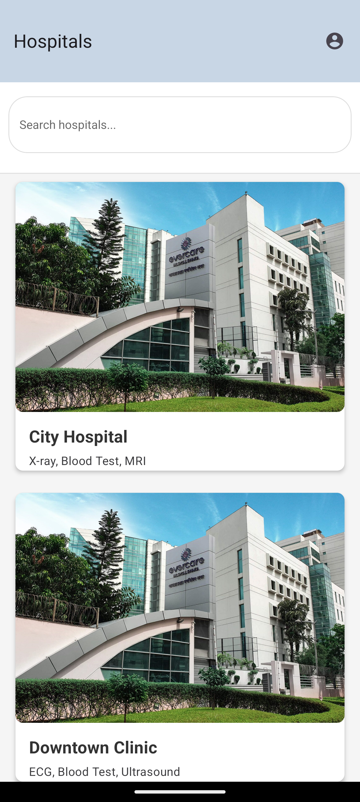

# 📚 Booking System

A complete **Hospital Booking System** built with **React Native** (Frontend) and **NestJS Microservices** (Backend).  
It features a clean UI, efficient APIs, scalable architecture, and reliable state management.

---

## 🚀 Technologies Used

**Frontend:**

- React Native – Core mobile app framework
- React Native Paper – UI component library
- Redux – Global state management
- Redux Toolkit – Simplified Redux setup
- Redux Persist – Persist and rehydrate Redux state
- Redux Logger – Middleware for logging Redux actions
- Yup – Schema validation for forms
- react-native-size-matters – Responsive sizing across device

**Backend:**

- NestJS – Progressive Node.js framework for scalable backend services
- GraphQL – Flexible and efficient API query language
- PostgreSQL – Robust, open-source relational database
- Docker – Containerized backend services for consistent deployment
- Microservices Architecture – Independent service modules for high scalability and maintainability

---

## 🎯 Features

**Frontend:**

- Authentication: Seamless login and registration flows
- Hospital Booking: Schedule appointments with doctors
- Form Validation: Strong validation using Yup
- State Management: Efficient handling with Redux Toolkit
- Persisted State: Retain user sessions with Redux Persist
- UI/UX: Modern design using React Native Paper
- Developer Tools: Debug with Redux Logger
- Responsive Design: Perfect scaling across devices

**Backend:**

- GraphQL API: Flexible and efficient data queries/mutations
- Modular Services: Scalable microservices (e.g., auth, booking, notifications)
- PostgreSQL Database: Secure, reliable storage
- Dockerized Setup: Consistent development and deployment environments
- Microservices: Independent, maintainable services for high scalability

---

## 📋 Why Microservices?

- **Scalability**: Scale parts of the system independently (e.g., bookings, users)
- **Maintainability**: Easier to update and debug isolated services
- **Deployment Flexibility**: Deploy services independently based on traffic needs
- **Resilience**: Isolated failures without impacting the full system
- **Team Collaboration**: Parallel development by different teams

---

## 🛠️ Installation & Setup

## 📋 Screenshots

### Login Screen





<!-- ### Booking Screen


### Confirmation Screen
 -->

### Frontend

```bash
# Clone the repository
git clone https://github.com/imransid/booking-system.git

# Navigate to frontend
cd booking-system/frontend/hospital-booking-app

# Install dependencies
yarn install
# or
npm install

# Start the app
yarn start
# or
npm start
Backend
bash
Copy
Edit
# Navigate to backend
cd booking-system/backend

# Set up environment variables
# (Copy .env.example to .env and update values)

# Install dependencies
yarn install
# or
npm install

# Run backend services with Docker
docker-compose up --build


📈 Future Improvements
Push Notifications Integration

Payment Gateway Integration

Admin Dashboard Panel

Role-based Authorization

Multi-language (i18n) Support

Unit & Integration Tests for APIs

🤝 Contributing
Pull requests are welcome!
For major changes, open an issue first to discuss proposed changes.

📝 License
This project is licensed under the MIT License.

🔥 Made with passion by Imran Khan (Rafa)
```

🔥 Made with passion by Imran Khan (Rafa)
📧 Email: imran1992@gmail.com

This file provides an overview of the system, including its features, technologies used, installation instructions, and more. It also includes your copyright information and email address. Let me know if you'd like to adjust anything!
